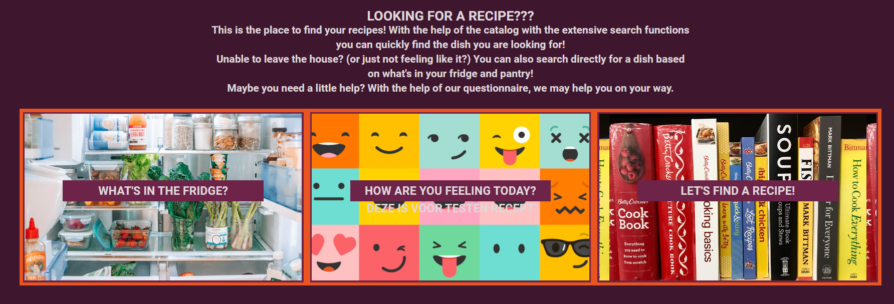
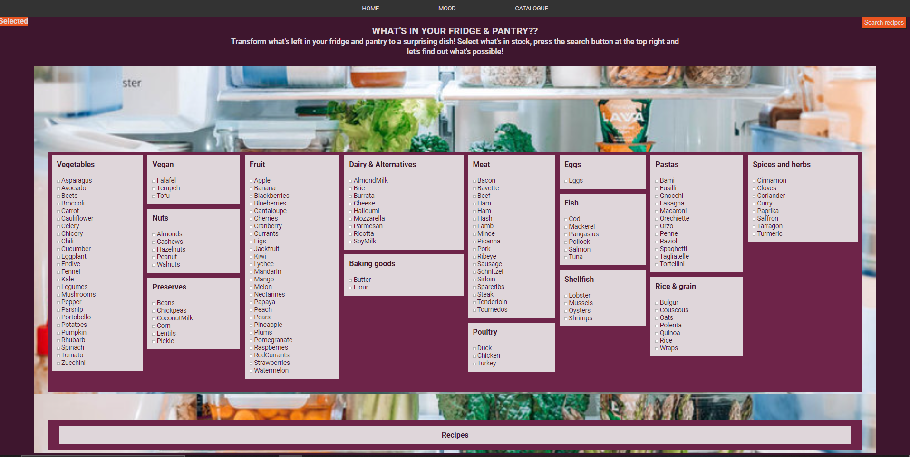
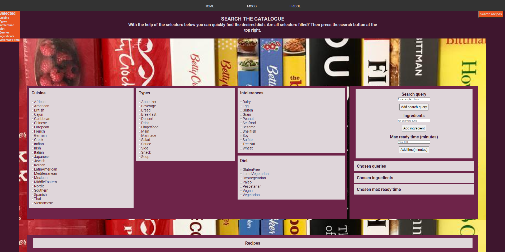
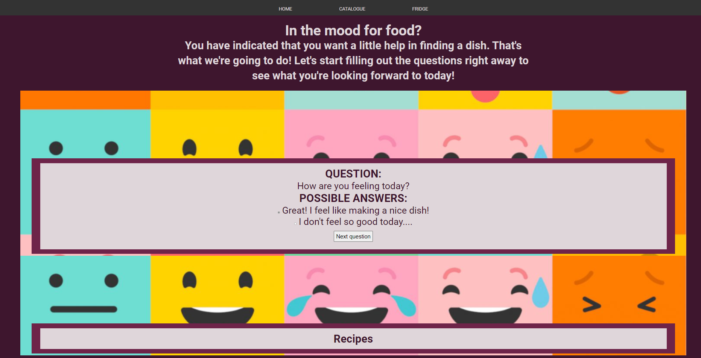

#Inhoudsopgave
1. Inleiding
2. Benodigdheden om de applicatie te kunnen gebruiken
3. Stappenplan installatie

#1. Inleiding

Met deze applicatie is het mogelijk om op 3 manieren naar gerechten te zoeken.

Wanneer de applicatie wordt geopend kan door op de betreffende links te drukken de methode worden gekozen.

Bij de eerste methode "What's in the fridge?" kunnen ingredienten worden aan en uit gevinkt en worden op deze manier aan de geselecteerde ingredienten toegevoegd. Wanneer de selectie compleet is, kan op de "search recipes" knop rechtsboven gedrukt worden en verschijnen de gerechten.

Bij de tweede methode "Let's find a recipe!" kunnen uit de categorien "cuisines", "types", "intolerances" en "Diet" meerdere items worden aan en uit gevinkt en worden op deze manier aan de geselecteerde items toegevoegd. Voor de query, ingredients en ready time wordt gebruik gemaakt van een zoekfunctie. Door op de "Add search query", "Add ingredient" of "Add time" knoppen te drukken worden die waarden aan de selected items toegevoegd. Wanneer de selectie compleet is, kan op de "search recipes" knop rechtsboven gedrukt worden en verschijnen de gerechten.

Bij de derde methode "How are you feeling today?" verschijnt een vraag in beeld, waarbij van een aantal antwoorden één antwoord geselecteerd kan worden. Als de vraag is geselecteerd kan op de "Next question" button worden gedrukt. De volgende vraag verschijnt. Als bij de laatste vraag is aangekomen, verdwijnt de "Next question" button en verschijnt de "Get recipes" button. Als hier op wordt gedrukt verschijnen de gerechten.

Bij alle drie de methodes verschijnen de gerechten in een lijst. Bij elk gerecht staat een button "Get more information". Als hierop wordt gedrukt verschijnt de link "Go te recipe information". Als hierop wordt gedrukt, verschijnt het gerecht met de ingredienten en de bereidingswijze op een nieuwe pagina.

#2. Benodigdheden om de applicatie te kunnen gebruiken

Om gebruik te maken van deze applicatie is een key nodig.
Deze wordt op 5 posities in de pagina's browseMain.js (1x), listMain.js (1x), questionMain.js (1x) en recipeMain.js (2x) aangeroepen.
In de datInput.js is bij paragraaf 4 de betreffende input van de apiKey te wijzigen.
Voor het gebruik van de applicatie wordt uitgegaan dat er gebruikt wordt gemaakt van  Webstorm.

#3. Stappenplan installatie

NPM, Parcel en Axios zijn al geconfigureerd. De bijbehorende dependencies moeten nog worden geïnstalleerd in de terminal:

`npm install`

De applicatie wordt gestart met het commando:

`npm run start`

De locatie van de server wordt weergegeven in de terminal, bv:

`Server running at http://localhost:1234`

Door op de link te drukken wordt de applicatie geopend in de browser.

De applicatie kan afgebroken worden door in de terminal te drukken:

`control+c`

De applicatie kan weer gestart worden met het commando:

`npm run start`
